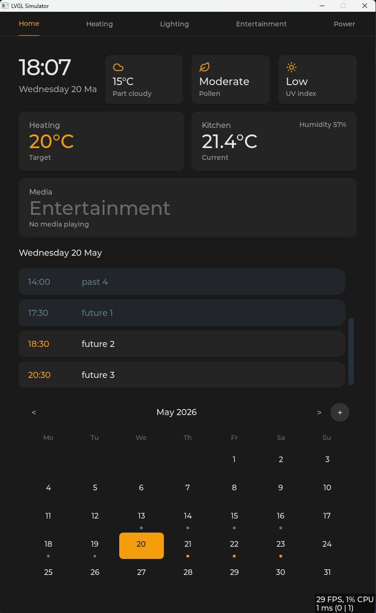

# Smart Dashboard

A bespoke, always-on kitchen wall panel built on **ESP32-P4** with a 10.1" 800×1280 touchscreen. Displays live Home Assistant data and household controls with a premium appliance aesthetic.



---

## What it does

- **Clock & date** — large numerals, SNTP-synced, minute-boundary update
- **Weather & conditions** — live temperature, weather state, pollen level, UV index from HA entities
- **Heating summary** — target and current room temperature from the HA climate entity
- **Calendar** — monthly grid with event dot indicators; tap any day to see events; create, edit, and delete events via touch with changes synced back to HA / Google Calendar
- **Extensible tab shell** — register a new tab in one line; the nav bar updates automatically, no hardcoded tab list

Initial tabs: **Home · Heating · Lighting · Entertainment · Power**  
Planned tabs: School Meals, Shopping List

---

## Architecture

```
┌─────────────────────────────────────────────────────┐
│                  Smart Dashboard                    │
│                                                     │
│  Shell (Nav Bar · Control Sheet)                    │
│  ├── Tab: Home (clock, weather, calendar/events)    │
│  ├── Tab: Heating (per-room thermostats)            │
│  ├── Tab: Lighting (brightness, colour temp, scenes)│
│  ├── Tab: Entertainment (media player, volume)      │
│  └── Tab: Power (whole-house energy monitoring)     │
│                                                     │
│  HA WebSocket Client (single persistent connection) │
│  ├── Entity subscriptions — push updates            │
│  ├── Service calls — control commands               │
│  └── calendar/get_events — on-demand fetch          │
└─────────────────────────────────────────────────────┘
              │                          │
    Home Assistant                     SNTP
  (sole data backend)              (clock only)
```

**Key constraints:**
- All data in and all commands out go through **Home Assistant** — no direct external API calls (except SNTP for time)
- All new features are built and validated in the **Simulator** before any firmware port
- UI is built with a custom **LVGL 9.4** widget tree — no SquareLine Vision scaffold

---

## Build targets

| Target | Description |
|--------|-------------|
| **Simulator** | SDL2 window on Windows PC — primary development target |
| **Firmware** | ESP32-P4 IDF build targeting the physical panel |

---

## Building the Simulator

### Prerequisites

[MSYS2 UCRT64](https://www.msys2.org/) with the following packages:

```bash
pacman -S mingw-w64-ucrt-x86_64-gcc \
          mingw-w64-ucrt-x86_64-cmake \
          mingw-w64-ucrt-x86_64-SDL2
```

LVGL 9.4.0 and cJSON are fetched automatically by CMake at configure time.

### Build

```bash
cd simulator
mkdir build && cd build
cmake -G "MinGW Makefiles" ..
make
./smart_dashboard_sim.exe
```

The window opens at 800×1280 with the dark-mode background (`#1a1a1a`).

### HA connection

Copy `src/ha_config.h.example` to `src/ha_config.h` and fill in your HA host and long-lived access token:

```c
#define HA_HOST  "homeassistant.local"
#define HA_PORT  8123
#define HA_TOKEN "eyJ..."
```

---

## Project structure

```
smartdashboard/
├── src/                  # Shared source (Simulator + Firmware)
│   ├── shell.*           # Persistent UI frame, nav bar
│   ├── tab_registry.*    # Tab registration and lookup
│   │
│   │                     # Home tab (split per ADR-0009):
│   ├── tab_home.*        # Home tab composition root (slim)
│   ├── home_summary.*    # Clock row + condition chips + indoor cards
│   ├── home_events_panel.* # Scrollable events list, swipe + delete flows
│   ├── home_calendar.*   # Calendar grid, day/month/year views, navigation
│   ├── home_ha_bridge.*  # Calendar fetch, month cache, cross-widget dispatch
│   │
│   ├── now_playing.*     # Now-playing widget on the Home tab
│   ├── media_art.*       # Album-art fetch + decode
│   ├── tab_entertainment.* # Entertainment tab (media player, volume, sources)
│   │
│   ├── clock_service.*   # SNTP-synced clock, LVGL label binding
│   ├── calendar_service.*# Local event store + shared event-on-day predicates
│   ├── event_edit.*      # Event create/edit sheet + sub-panel orchestration
│   ├── sheet.*           # Sheet primitive (spring-in, drag-dismiss)
│   ├── date_picker.*     # Date picker sub-panel
│   ├── time_picker.*     # Time picker sub-panel
│   ├── keyboard.*        # Custom LVGL keyboard sub-panel
│   ├── control_sheet.*   # Control sheet (brightness, sleep, HA status)
│   ├── config_sheet.*    # Config sheet (HA host, entity IDs)
│   │
│   ├── ha_ws_client.*    # HA WebSocket connection, subscriptions, service calls
│   ├── ha_credentials.*  # Runtime HA host/token state
│   ├── ha_http_config.*  # On-device HTTP config endpoint
│   ├── google_calendar.* # Google Calendar OAuth + REST writes
│   ├── display_sleep.*   # Presence-driven display sleep
│   │
│   ├── dashboard_config.*# Persistent config (file on Sim, NVS on Firmware)
│   ├── dashboard_colours.h
│   ├── dashboard_icons.* # Embedded SVG icons (generated by embed_icons.py)
│   ├── dashboard_log.h   # LOG_D/I/W/E macros
│   ├── dashboard_lv_utils.* # Shared LVGL style helpers (obj_clear, obj_card)
│   └── text_sub.*        # UTF-8 character substitution for unsupported glyphs
├── simulator/
│   ├── main.c            # SDL2 driver and LVGL tick loop
│   ├── CMakeLists.txt
│   └── lv_conf.h         # LVGL configuration for Simulator
├── assets/
│   ├── icons/            # Source SVGs (24×24, amber stroke)
│   └── fonts/            # Pre-baked Inter LVGL font files
└── tools/
    └── embed_icons.py    # Regenerates dashboard_icons.c from assets/icons/
```

---

## Design system

| Token | Value | Role |
|-------|-------|------|
| `COL_BG` | `#1a1a1a` | Background |
| `COL_SURFACE` | `#242424` | Card surface |
| `COL_BORDER` | `#333333` | Borders and wells |
| `COL_ACCENT` | `#f59e0b` | Amber — active, selected, values |
| `COL_PAST` | `#5C7A8A` | Past / inactive |
| `COL_TEXT` | `#e5e5e5` | Body text |
| `COL_DIM` | `#a3a3a3` | Dim / secondary text |

Typography: Inter 400 and 600 only — no third weight, no italics. No gradients, no shadows, solid fills only.

---

## Status

| Issue | Description | Status |
|-------|-------------|--------|
| 01 | Simulator scaffold & logging | ✅ Done |
| 02a | Tab registry & shell | ✅ Done |
| 02b | Control sheet | ✅ Done |
| 03 | Dashboard config (file / NVS) | ✅ Done |
| 04 | Clock service | ✅ Done |
| 05 | HA WebSocket client | ✅ Done |
| 05b | HA per-entity subscriptions | ✅ Done |
| 06 | Home tab layout | ✅ Done |
| 07 | Calendar view (read-only) | ✅ Done |
| 08 | Sheet primitive | ✅ Done |
| 09 | Date & time pickers | ✅ Done |
| 09b | Keyboard module | ✅ Done |
| 10a | Event create / edit | ✅ Done |
| 10b | HA calendar write path (create/update → HA → Google) | 🔄 Ready |
| 10c | Event deletion | 🔜 After #10b |
| 11 | Display sleep / Wake-on-Presence | 🔄 Ready |
| 12 | HA credentials via NVS + web config | 🔄 Ready (needs hardware) |
| 13 | Weather state icons | 🔄 Ready |

---

## Hardware

- **SoC:** ESP32-P4
- **Display:** 10.1" IPS touchscreen, 800×1280
- **Connectivity:** WiFi (HA WebSocket, SNTP)
- **Mount:** Permanent flush-mount kitchen wall panel

---

## License

This project is licensed under the GNU General Public Licence v3.0 — see the [LICENCE](LICENCE) file for details.